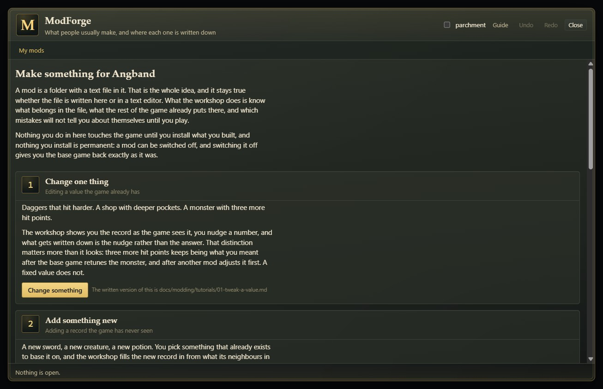

# ModForge

Make your own Neo Angband mod from inside the game.

Pick something that already exists - a monster, a sword, a shop, a spell - and the
workshop shows you what it is made of, what its neighbours in the game carry for
every number, and what would have to change to make the thing you had in mind.
When you are happy it packs the result up: try it in this session to play it
straight away, install it to keep it, or save it as a file to hand to somebody.

It never asks you what JSON is. It also never hides it: every screen can show you
the exact file it is about to write, and a mod it built can be taken away,
hand-edited and brought back.



## Status

**Available today. The workshop opens, every screen works, the mod it emits is a real mod,
and you can load that mod into the running game for the rest of the session.**
On Neo Angband 1.0.0 it is connected to the game's own authoring SDK and the full
set of records composed for the running session, including enabled content mods.
Suggestions, peer tables, validation and the content-kind list therefore describe
the game the player is actually running. [docs/ENGINE_SEAMS.md](docs/ENGINE_SEAMS.md)
records the production path and all five seam decisions precisely.

It needs Neo Angband 1.0.0 or newer. That release carries both live-authoring
seams as well as the session-load and test surfaces ModForge uses.

The small demonstration fixture remains only as a compatibility and standalone
development fallback. If either live-data seam is absent, the workshop stays
open but shows an undismissable banner identifying the fallback. That banner is
hidden when the real SDK and composed records are present, which is the normal
in-game path for every engine version this release supports.

## What it does

**Adds records.** A new monster, a new sword, a new potion, a new artifact, in any
of the forty-odd record files the game composes one record at a time. You base it
on something that already exists, and the workshop fills it in from what its
comparables in the game actually carry rather than leaving it blank. It inherits
shape and scale and none of its powers: a new orc arrives with the orc's hit
points and armour and no attacks at all until you say otherwise.

**Adjusts records the game already owns.** Your mod ships the difference rather
than the record, so the base game keeps owning it and two mods adjusting different
fields of the same record both work.

**Retunes a whole set at once.** Every potion cheaper, every dragon faster, every
shop's purse deeper. Filter a file down to what you mean, choose one adjustment,
and every record that matched gets its own entry.

**Explains every number it chose.** Not "speed 120" but "speed 120, because every
dog within seven levels of depth 3 has it". The evidence table beside the editor
answers "is forty hit points a lot for a depth-three dog" with the game's own data
rather than with a manual.

**Checks as you type.** A name that collides with something already loaded, a
field nothing in the file uses, a monster with no depth that would exist and never
be met, a reference to something no loaded pack defines. Errors are separated from
warnings and from advice, and clicking one takes you to the field it is about.

**Writes the paperwork you would have got wrong.** A mod may only adjust a record
whose owner it declares as a dependency, and a change refused for want of that
declaration costs you the change and not the mod, silently. The workshop writes
the dependency at the moment you pick the record. It also picks the load-order
group from what you actually did, writes an engine range that is a minimum rather
than a pin, and defaults the repository to an address that is obviously yours.

**Prefers the change that survives other people.** Nudging a number writes "three
more than whatever this is" rather than a fixed value, so it keeps meaning what you
meant after a game update retunes it and after another mod adjusts it first.
Ticking a flag writes "add this flag", so another mod adding a different flag to
the same record keeps its change and you keep yours.

## When you outgrow the screens: editing the files

Every screen above asks a question and writes the answer into a file. There is one
more screen, reached with **Edit the files directly** from a mod's own page, that
shows the files.

**It is the same mod, printed.** Not a mode, not an import, not a second copy. A
monster added on the record screen is in `monster.json` there; a number changed
there is the number the record screen shows next time you open it. Saving a file
parses the text back into the mod that every other screen edits, which is why the
two can never come apart.

It has line numbers, syntax colouring for JSON and JavaScript, bracket matching,
Tab and Shift-Tab to indent and outdent, `Ctrl+F` to find, `Ctrl+S` to save the
file, and a line and column readout. `Ctrl+Z` in the editor is the browser's own
undo over your typing; `Ctrl+Z` anywhere else is the workshop's undo over the mod.

**Brackets and quotes close themselves**, and the rules that stop that being a
nuisance are worth knowing. A pair only appears where a closer could go - at the
end of a line, before whitespace, or before something that already closes - so
typing `(` in front of a word inserts one character and nothing else. Typing the
closing character when it is already there steps over it instead of doubling it.
Backspace or Delete between an empty pair takes both. A selection is wrapped rather
than replaced, so selecting a word and typing `"` quotes it. Enter inside an empty
pair opens the block with the closer on its own line. JSON pairs the one quote it
has and not an apostrophe; Markdown and plain text pair nothing at all, because
prose is full of brackets that never close.

**A record file is checked as you type, by the same checker the record screens
use.** Not a weaker copy of it: the text is parsed through the same code a save
goes through, composed on top of the game, and handed to the engine's own record
checker, so a field whose value is the wrong type, a field name that is spelled
wrong, a reference to something nothing defines and a record that will never be
generated all appear under the editor with the line they are on. Click one to go to
it. Each row says which rule found it.

One SDK rule is deliberately only a hint: a value outside the set of values the
game's own records use for that field. A mod coining a new value is legal, but the
same shape can be a typo in an existing vocabulary. The rule is
`field/vocabulary`, and the message says that it is the SDK's advice rather than a
load-time refusal.

**Three things are only possible here**, and they are why it exists rather than
being a viewer:

- **A script.** `Start a plugin.js` writes a working entry point with nothing in
  it. A `plugin.js` needs no build step: it is an ES module with no bare imports
  and a default export, and the engine arrives as `ctx.core`. The manifest grows
  the `plugin` facet and the `modApi` number by itself, because a mod that ships
  code without declaring both installs and then does nothing.
- **A manifest key nothing asks you about.** `capabilities`, `rules` a player can
  switch on and off, `optionalDependencies`. The game passes a key it does not
  model straight through, so these work, and they survive every later save.
- **Sections and anything else a record file can carry.** Written through to the
  folder exactly as typed.
- **A tile, a font or a sound.** Loaded from disk and carried as its exact bytes
  rather than as text - there is nothing to type or colour in, so the panel that
  takes the place of the editor says so, and offers to replace the file with
  another one from disk instead.

**What it will not pretend.** The check under a JSON file is the same parser the
game uses, so a clean file is really clean. The record checks are only as good as
the checker this game can lend the workshop: where it cannot lend one, a row at the
top of the pane says so and does not go away, and everything below it is the
workshop's smaller stand-in rather than the game's. A clean record file is also not
a clean mod, so the pane counts what the same check found elsewhere and points at
the review screen. The check under a script is quotes, comments and brackets, and it
says so: it is not a syntax check, there is no compiler in a browser tab, and code
that passes it can still be wrong. A mod that
ships a script also cannot be tried for a session, because that door takes content
only - save it as a file and add it with `Import a zip`, which is the door that
runs code and asks you first. The button says which of those you are looking at
before you press it.

**It is not the way in.** A first mod made here is a first mod made without the
evidence table, without the sentence saying where each suggested number came from,
and without the check that runs as you type. Start with the screens. This is the
door at the far end of them.

## What it does not do, and why

**It does not write code for you.** It will carry a `plugin.js` you wrote, and it
will not produce one: a mod written in TypeScript becomes a module through a
bundler that runs in Node, and there is no bundler in a browser tab. Everything a
first mod is likely to be - a monster, a sword, a rebalanced spell, an item in a
shop, an artifact - is content and needs no build step at all.
`docs/modding/PLUGINS.md` in the game's own repository is the path for a mod that
does run code, and `docs/modding/tutorials/05-hook-behaviour.md` is ten lines of
it.

**It does not preview or validate a picture, a sound or a font.** A tile, a font
or a sound can be loaded from disk in the file editor and is carried in the
emitted mod as its exact bytes, but the workshop never looks inside one: nothing
here shows what an image looks like, plays a sound, or checks that the bytes are
actually a valid file of the kind the name suggests.

**It does not open a mod you already have.** The editor edits the mod in the
workshop. A finished mod is a folder with a text editor and a repository behind
it, which is a better place to work on one.

**It does not offer `constants`, `visuals` or `history`.** Those three are
whole-file configuration rather than records with identities, so contributing one
means "use mine instead of the game's", which the project builder promotes to a
hard error. That is the format being honest about identity rather than a gap.

**It does not draw a tile for what you make.** A new monster with no tile falls
back to its letter. `neo-linoleum` derives a tile for mod-added content from its
kin, and the tile door allows one filler per mod, so pointing at that mod is
better citizenship than competing with it. It is not a dependency: a mod without
tiles works, it just looks like Angband did for thirty years.

## Getting it

Install it the way you install any mod: the Mods screen, then `Install a
mod...`, then this repository's address
(`https://github.com/neostryder/neo-angband-mod-forge`). See [CHANGELOG.md](CHANGELOG.md) for
what each released version changed.

## Using it

A tab reading `Build a mod` appears in the bottom corner of the main screen. Tap
it. The workshop opens over the game, takes the keyboard while it is open, and
gives it back when you close it. Nothing you do in there touches the game until
you install what you built.

Escape backs out of the innermost thing: a tooltip, then a level of nesting inside
a record, then the screen, then the workshop. Nothing on that ladder discards
anything.

`Ctrl+Z` and `Ctrl+Shift+Z` undo and redo. `Ctrl+S` saves the mod as a file, or
saves the open file into the mod when the caret is in the file editor.

## Getting the mod out

**Save it as a file.** Always available. You get a zip, which the Mods screen's
`Import a zip` accepts, and which you can also open, read, hand to somebody and
push to a repository. This is the only copy of your work that exists outside the
browser's storage, which is why the button is on every screen.

**Try it in the game.** One button, on every screen a mod is open on. It forges the
mod, loads it for the rest of the session without adding it to your mods, and
reloads the game so it takes effect. It is forgotten when you close the game, so
iterating costs you nothing in your library.

It is the real mod and not a preview, which cuts both ways. The pack composes into
the game exactly as an installed one does, so play a character you do not mind
changing: next time, with the mod gone, the game treats anything it added as
belonging to something that is not installed, and a value it adjusted goes back to
what it was. What is temporary is the mod, not what it did.

The reload is not optional and never was, because composing content always needs
one. What changed is who does it: the workshop used to say "reload to play it" and
leave you to find the Close button and press Ctrl-R.

**Install it in place.** Deliberately absent. A mod that can put another mod into
your library is an elevated permission, and the only thing it would buy is a click
the button above already saves. Permanence is worth visiting the mod manager for,
and a mod on disk is one you can read, keep and hand to somebody.

## Unfinished work, and the one honest warning

Drafts are kept in this install's own settings rather than in any character's
save, so they survive a character dying and they are gone if you clear the
browser's storage for the game. That store can also quietly run out of room: its
own write path catches a quota error and logs it rather than failing. The workshop
reads every write back and tells you at the moment one did not take, and it caps
what it will try to store rather than discovering the limit.

**So a mod saved as a file is the only save point the workshop will promise you.**
It says so on the screen where it matters, and the button is one click from
anywhere.

## Learning to mod

The workshop's `Guide` covers the four things people usually make, and each card
names the game's own written tutorial for the same idea. The two teach the same
steps in the same order on purpose: an author who finishes the tour and then opens
tutorial 3 has to find the same ideas under the same names.

If you would rather have a text editor open, that path is real and it is not
second class. A mod is a folder with a text file in it, and it will always be.
These four live in the game's own repository, not this one:

- `docs/modding/tutorials/` builds seven mods from nothing, in a text editor.
- `docs/modding/PLUGINS.md` is how a mod runs code.
- `docs/modding/AUTHORING.md` is the library this workshop itself calls.
- `docs/modding/MOD_COMPATIBILITY.md` is what surviving a game update takes.

This checkout also has [`docs/PLUGIN_TESTING.md`](docs/PLUGIN_TESTING.md), which
shows how a third-party author tests the committed `plugin.js` against real
composed records and a real engine transition from their own repository.

A mod the workshop wrote is an ordinary folder of ordinary files. Take it out,
edit it in anything, and bring it back. Nothing in it belongs to the workshop -
that rule is what keeps this a helper rather than a format owner, and it is the
one rule here that is never bent.

## Settings

Three, in the mod manager:

| Setting | Default | What it does |
| --- | --- | --- |
| Show the workshop tab | on | The tab in the corner, which is the only way in. |
| Remember work in progress | on | Keep unfinished mods between sessions. |
| Let me test what I built, in the game | **off** | A Test panel that arranges the game around the thing you made. |

The third is off, and it stays off until you say otherwise, for one reason. Testing
one record honestly means arranging everything around it - a monster written for
dungeon level forty tells you nothing on level one - so the panel carries the game's
own debug set: go to a depth, gain experience, set gold and stats, acquire items,
summon, banish, teleport, map the level, light it, learn everything.

**Not one control on it works until the panel has stopped this session being saved,
and that cannot be undone.** Your character on disk keeps whatever their last save
left and nothing after that is ever written, so testing can never spoil a character
you are keeping. Reload the game and they are waiting exactly as they were. What you
give up is the session you tested in, which is the point: it was a scratchpad. The
panel names the character and says all of this before the button that spends it.

Its browser puts your own content at the top, marked with the pack that added it,
and it is not limited to it - the whole game's catalogue is behind the same filter,
because the record you are modelling yours on is usually the one you want to compare
against.

## Building this repository

The repository root is the mod folder: `manifest.json` and `plugin.js` sit beside
the source they are built from, because that pair is what the game fetches.

```
npm ci
npm run verify     # typecheck, test, and prove the committed plugin.js is current
npm run build      # rebuild plugin.js from the source
```

The tests boot the workshop into a synthetic document and drive it by clicking
things, so they fail when a label stops saying what it does. They need no running
game: most deliberately exercise the demonstration fallback, while integration
coverage in the engine repository runs the same plugin against real composed
records.

To develop against an engine change that has not been released yet:

```
NEO_ANGBAND_LOCAL_CORE=1 npm test
```

To look at the workshop in a browser with no game at all:

```
npm run preview
```

That serves the repository on the loopback interface and opens a harness page which
builds the narrowest context the mod actually reads, hands it to the plugin, and
taps the tab. Every seam is absent by default so the compatibility fallback stays
easy to inspect. This is deliberately different from Neo Angband 1.0.0's in-game
path, which supplies the authoring SDK and the composed records. The same
`plugin.js` loaded by the real game is the one this page loads, so the two are the
same mod and not two builds of it.

Adding `?authoring=sdk` to that page puts the real mod SDK behind `ctx.authoring`,
which is the one live-data seam a standalone harness can honestly supply: the SDK is already a
devDependency here, its `dist` is plain ES modules, and the preview server serves
the repository. It matters for anything that reads a field's measured shape, because the
stand-in in `src/host/authoring-stub.ts` is a deliberately small subset with no
field-type rule and none of the companion rules - so a check that passes against
the stand-in has been shown very little.

`ctx.composedRecords` is still the fixture in the standalone preview even with that
flag, and there is no way around it: the published core package carries the engine's
code and not its content pack. Inside the game the boot path supplies the real
composition. In the preview, anything that reads the whole composed world is still
measured against a few dozen invented records, and the workshop's own banner keeps
saying so.

Asking about AI use in this project? [AI_USAGE_POLICY.md](AI_USAGE_POLICY.md) is
the complete answer.

## Questions, or something wrong

[**The RPGM Tools Discord**](https://discord.gg/YegtwbHTBQ) is the fastest way
to ask anything - whether a screen is doing what it should, how to get the
workshop running, or what to try next. No GitHub account needed.

[Open an issue here](../../issues/new/choose) for a bug in **this mod**. A mod
this workshop built behaving wrongly once loaded into the game belongs against
the game instead - the workshop's job ends at the file it writes.

For anything that should not be public, including a security report:
**strider-angband (at) rpgm.tools**. See [SECURITY.md](SECURITY.md), which also
links to the core policy for anything owned by the engine rather than this mod.

[TERMS.md](TERMS.md) covers use of this mod. The core repository's
[PRIVACY.md](https://github.com/neostryder/neo-angband/blob/master/PRIVACY.md)
covers what is stored and what network requests the game makes. Project
participation is subject to the shared [CODE_OF_CONDUCT.md](CODE_OF_CONDUCT.md).

## Licence

GPL-2.0-only, or the Angband licence. See [LICENSE.md](LICENSE.md).

## Credits

Built by neostryder / RPGM Tools as part of Neo Angband. Angband is the work of
Ben Harrison, James E. Wilson, Robert A. Koeneke and the Angband contributors.
