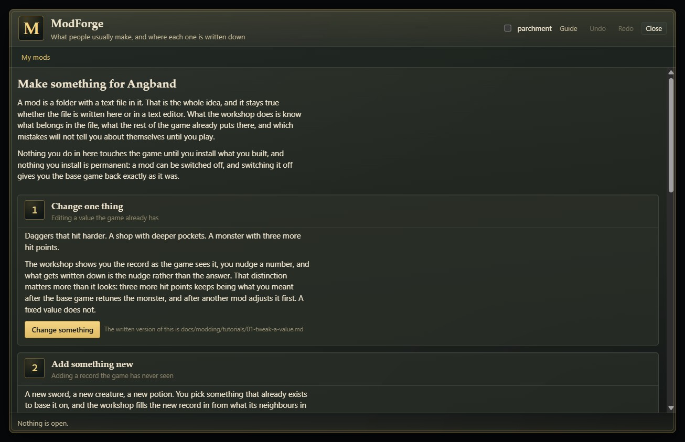

# ModForge

Make your own Neo Angband mod from inside the game.

Pick something that already exists - a monster, a sword, a shop, a spell - and the
workshop shows you what it is made of, what its neighbours in the game carry for
every number, and what would have to change to make the thing you had in mind.
When you are happy it packs the result up: try it in this session to play it
straight away, or save it as a file to hand to somebody or add through the Mods
screen.

It never asks you what JSON is. It also never hides it: every screen can show you
the exact file it is about to write, and a mod it built can be taken away,
hand-edited and brought back.



## Status

ModForge works today: the workshop opens, every screen works, the mod it writes is a real mod, and you can load that mod into the running game for the rest of the session.

It needs Neo Angband 1.0.0 or newer. That release gives the workshop everything it uses: the game's own authoring tools, the full set of records the current session was built from (including any content mods you have enabled), loading a mod for one session, and the test tools. So its suggestions, comparison tables, checks and list of content kinds all describe the game you are playing. [docs/ENGINE_SEAMS.md](docs/ENGINE_SEAMS.md) covers the production path and all five seams in detail.

If either of the two live-data connections is missing, the workshop still opens, but it falls back to a small built-in demonstration data set and shows a banner saying so that cannot be dismissed. In the normal in-game setup, on any engine version this release supports, the banner does not appear.
## Mod authoring features

You can add a new monster, sword, potion or artifact to any of the forty-odd record files the game builds one record at a time. You base it on something that already exists, and the workshop fills it in from what similar things in the game actually carry instead of leaving it blank. It copies shape and scale but none of the powers: a new orc arrives with an orc's hit points and armour and no attacks until you give it some.

When you change a record the game already has, your mod ships only the difference. The base game keeps owning the record, and two mods changing different fields of the same record both work.

You can retune a whole set at once: every potion cheaper, every dragon faster, every shop's purse deeper. Filter a file down to what you mean, choose one adjustment, and every matching record gets its own entry.

Every suggested number comes with its reason. The evidence table beside the editor says things like "speed 120, because every dog within seven levels of depth 3 has it", and it can tell you whether forty hit points is a lot for a depth-three dog from the game's own data.

Checks run as you type. They catch a name that collides with something already loaded, a field nothing else in the file uses, a monster with no depth (which would exist but never be met), and a reference to something no loaded pack defines. Errors, warnings and advice are listed separately, and clicking one takes you to the field it is about.

A mod may only change a record if it declares the record's owner as a dependency. Without that declaration the change is dropped silently, though the rest of the mod still works. The workshop writes the dependency as soon as you pick the record. It also picks the load-order group from what you actually did, writes an engine range that is a minimum rather than one exact version, and defaults the repository to an address that is clearly yours.

Nudging a number writes "three more than whatever this is" instead of a fixed value, so it still means what you intended after a game update retunes it or another mod adjusts it first. Ticking a flag writes "add this flag", so if another mod adds a different flag to the same record, both changes survive.

You can fork an existing mod into one of your own: a mod installed in this game, a mod folder picked from disk, or a mod saved as a zip. A fork owns its content outright instead of patching somebody else's, so the original does not need to be installed for yours to work. The fork needs an id of its own before you can take it, keeps the original's licence, and records in its manifest what it was forked from. Anything the fork could not carry over is listed where you made it, since those differences are worth reading. You cannot fork straight from a repository address, because fetching one is the game's job and nothing passes that job to a mod. Install the mod first and fork it from the list, or download its folder and pick that.
## When you outgrow the screens: editing the files

Every screen above asks a question and writes the answer into a file. One more screen, opened with **Edit the files directly** from a mod's own page, shows you those files.

The file editor works on the same mod as every other screen. A monster added on the record screen appears in `monster.json` here, and a number you change here is the number the record screen shows next time. Saving a file parses the text back into the mod, so the editor and the screens always agree.

It has line numbers, syntax colouring for JSON and JavaScript, bracket matching, Tab and Shift-Tab to indent and outdent, `Ctrl+F` to find, `Ctrl+S` to save the file, and a line and column readout. `Ctrl+Z` in the editor is the browser's own undo over your typing; `Ctrl+Z` anywhere else is the workshop's undo over the mod.

`Ctrl+Shift+F`, or the "Search everywhere" button on the find bar, searches every file the mod would write, not just the open one. The results show the file, the line and a snippet for each match, and clicking one opens that file at that line. **See the changes** on the toolbar compares what is in the editor with what the mod has saved for that file, line by line, in the same +/- format a terminal `diff` uses.

Brackets and quotes close themselves, with a few rules so this stays out of your way. A closing character is only added where one could go: at the end of a line, before whitespace, or before something that already closes, so typing `(` in front of a word inserts just the one character. Typing a closing character that is already there steps over it. Backspace or Delete between an empty pair removes both. Typing a quote or bracket with text selected wraps the selection, so selecting a word and typing `"` quotes it. Enter inside an empty pair puts the closer on its own line. JSON pairs double quotes but not apostrophes, and Markdown and plain text pair nothing, because prose is full of brackets that never close.

Each record file is checked as you type by the same checker the record screens use. The text goes through the same parsing a save does, is combined with the game's own records, and is handed to the engine's record checker. A field with the wrong type of value, a misspelled field name, a reference to something nothing defines and a record that will never be generated all show up under the editor with their line numbers. Click one to jump to it. Each row says which rule found it.
One SDK rule is only a hint: a value outside the set of values the game's own records use for that field. A mod may coin a new value, but the same thing can also be a typo in an existing set. The rule is `field/vocabulary`, and its message says it is the SDK's advice rather than something that stops the mod loading.

Three things are only possible here, which is why this is an editor and not just a viewer:

- `Start a plugin.js` writes an empty working script entry point. A `plugin.js` needs no build step: it is an ES module with no bare imports and a default export, and the engine arrives as `ctx.core`. The manifest gains the `plugin` facet and the `modApi` number automatically, because a mod that ships code without declaring both installs and then does nothing.
- The editor accepts manifest keys that no screen asks about: `capabilities`, `rules` a player can switch on and off, and `optionalDependencies`. The game passes keys it does not model straight through, so these work and survive every later save.
- Sections, and anything else a record file can carry, are written to the folder exactly as you typed them.
- A tile, a font or a sound is loaded from disk and kept as its exact bytes. There is nothing to type or colour, so a panel takes the editor's place, says so, and offers to replace the file with another one from disk.

The JSON check uses the game's own parser, so a file that passes it will parse in the game. The record checks can only be as good as the checker the game lends the workshop. If it cannot lend one, a row at the top of the pane says so and stays there, and everything below it comes from the workshop's smaller stand-in. A clean record file does not mean a clean mod, so the pane also counts problems the same check found elsewhere and points you to the review screen. For scripts, the check only covers quotes, comments and brackets, and it tells you so: there is no compiler in a browser tab, and code that passes can still be wrong.

A mod that ships a script cannot be tried for a session, because that option loads content only. Save it as a file and add it with `Import a zip`, which runs code and asks you first. The button tells you which of the two you are looking at before you press it.

Start with the screens rather than here. A first mod made in the file editor goes without the evidence table, the explanation of where each suggested number came from, and the checks that run as you type. Come to the file editor once the screens are not enough.
## Workshop limits

`Start a plugin.js` puts a working entry template in the mod, but what goes inside it is up to you. A mod written in TypeScript has to go through a bundler that runs in Node to become a module, and there is no bundler in a browser tab. Most first mods (a monster, a sword, a rebalanced spell, an item in a shop, an artifact) are content and need no build step at all. The workshop's Docs screen carries the SDK's complete `PLUGINS.md` reference and tutorial 5, the ten-line behaviour hook.

A tile, a font or a sound can be loaded from disk in the file editor and is carried in the finished mod as its exact bytes, but the workshop never looks inside one. It cannot show you an image, play a sound, or check that the bytes are a valid file of the kind the name suggests.

The workshop only opens a mod you already have by forking it, which makes a separate mod with its own id. You cannot edit an installed mod in place, and that is not planned: a mod on disk has a folder, a text editor and a repository behind it, and editing the installed copy from inside the game would put your changes somewhere no version of them is kept.

The editor does not offer `constants`, `visuals` or `history`. Those three are whole-file configuration rather than records with identities, so contributing one means "use mine instead of the game's", which the project builder treats as a hard error.

A new monster with no tile is drawn as its letter. `neo-linoleum` derives tiles for mod-added content from related records, and the game accepts one tile filler per mod, so ModForge leaves that job to linoleum instead of competing with it. Linoleum is not a dependency: a mod without tiles works, and looks the way Angband has looked for thirty years.
## Getting it

Install it the way you install any mod: the Mods screen, then `Install a
mod...`, then this repository's address
(`https://github.com/neostryder/neo-angband-mod-forge`). See [CHANGELOG.md](CHANGELOG.md) for
what each released version changed.

## Using it

A tab reading `Build a mod` appears in the bottom corner of the main screen. Tap
it. The workshop opens over the game, takes the keyboard while it is open, and
gives it back when you close it. Nothing you do in there touches the game until
you try the mod for this session or add its saved file through the Mods screen.

Escape backs out of the innermost thing: a tooltip, then a level of nesting inside
a record, then the screen, then the workshop. Nothing on that ladder discards
anything.

`Ctrl+Z` and `Ctrl+Shift+Z` undo and redo. `Ctrl+S` saves the mod as a file, or
saves the open file into the mod when the caret is in the file editor.

## Getting the mod out

Save it as a file. This is always available. You get a zip, which the Mods screen's `Import a zip` accepts, and which you can also open, read, hand to somebody or push to a repository. It is the only copy of your work outside the browser's storage, which is why the button is on every screen.

Try it in the game with the button on every screen where a mod is open. It builds the mod, loads it for the rest of the session without adding it to your mods, and reloads the game so it takes effect. It is forgotten when you close the game, so trying things out leaves nothing behind in your library.

This loads the real mod, into the game exactly as an installed one would be, so play a character you do not mind changing. Next time, with the mod gone, the game treats anything it added as belonging to a mod that is not installed, and any value it adjusted goes back to what it was.

The reload always happens, because new content only takes effect on a reload. The workshop does it for you; it used to tell you to reload and leave you to find the Close button and press Ctrl-R.

There is no button to install the mod permanently from inside the workshop. It would mean giving one mod permission to put another into your library, only to save a click the button above already saves. When you want to keep a mod, use the mod manager; a mod saved on disk is one you can read, keep and hand to somebody.
## Unfinished work

Drafts are kept in this install's own settings, not in any character's save, so they survive a character dying but disappear if you clear the browser's storage for the game. That storage can also run out of room without an error, because its write path catches a quota error and only logs it. The workshop reads every write back, tells you as soon as one did not take, and caps how much it stores instead of finding the limit by running into it.

Saving the mod as a file is the only way to be sure your work is kept. The workshop says so on the screen where it matters, and the button is one click from anywhere.
## Learning to mod

The workshop's `Guide` covers the four things people usually make, and each card names the game's own written tutorial for the same idea. Both teach the same steps in the same order, so if you finish the tour and then open tutorial 3, you find the same ideas under the same names.

If you would rather work in a text editor, that works just as well. A mod is a folder with a text file in it, and it always will be. These SDK documents are bundled under Docs in the workshop, copied at build time from the game's generated SDK package:

- `tutorials/` builds seven mods from nothing, in a text editor.
- `PLUGINS.md` is how a mod runs code.
- `AUTHORING.md` is the library this workshop itself calls.
- `MOD_COMPATIBILITY.md` is what surviving a game update takes.

This repository also has [`docs/PLUGIN_TESTING.md`](docs/PLUGIN_TESTING.md), which shows how a third-party author can test a committed `plugin.js` against real composed records and a real engine transition from their own repository.

A mod the workshop wrote is an ordinary folder of ordinary files. Take it out, edit it in anything, and bring it back. Nothing in it belongs to the workshop, and that will not change.
## Settings

Three, in the mod manager:

See the [settings reference](SETTINGS.md) for every flag, its default, and when a change takes effect.

| Setting | Default | What it does |
| --- | --- | --- |
| Show the workshop tab | on | The tab in the corner, which is the only way in. |
| Remember work in progress | on | Keep unfinished mods between sessions. |
| Let me test what I built, in the game | **off** | A Test panel that arranges the game around the thing you made. |

The third is off until you turn it on. Testing one record properly means arranging everything around it (a monster written for dungeon level forty tells you nothing on level one), so the panel carries the game's own debug set: go to a depth, gain experience, set gold and stats, acquire items, summon, banish, teleport, map the level, light it, learn everything.

**None of its controls work until the panel has stopped this session from being saved, and that cannot be undone.** Your character on disk keeps whatever their last save held and nothing after that is ever written, so testing can never spoil a character you are keeping. Reload the game and they are waiting exactly as they were. You give up only the session you tested in, which serves as a scratchpad. The panel names the character and explains all of this before the button that turns saving off.

Its browser puts your own content at the top, marked with the pack that added it, but the whole game's catalogue is behind the same filter, because the record you are basing yours on is usually the one you want to compare against.

## Building this repository

The repository root is the mod folder: `manifest.json` and `plugin.js` sit beside
the source they are built from, because that pair is what the game fetches.

```
pnpm install --frozen-lockfile
pnpm verify     # typecheck, test, and prove the committed plugin.js is current
pnpm build      # rebuild plugin.js from the source
```

The tests boot the workshop into a synthetic document and drive it by clicking, so they fail when a label stops matching what it does. They need no running game. Most run against the demonstration fallback, and integration tests in the engine repository run the same plugin against real composed records.

To develop against an engine change that has not been released yet:

```
NEO_ANGBAND_LOCAL_CORE=1 pnpm test
```

To look at the workshop in a browser with no game at all:

```
pnpm preview
```

That serves the repository on the loopback interface and opens a harness page, which builds the smallest context the mod reads, hands it to the plugin, and taps the tab. Every seam is absent by default, so the fallback is easy to inspect; the in-game path on Neo Angband 1.0.0 supplies the authoring SDK and the composed records instead. The harness loads the same `plugin.js` the game loads, not a separate build.

Adding `?authoring=sdk` to the page URL puts the real mod SDK behind `ctx.authoring`. That is the only live-data seam a standalone harness can supply for real: the SDK is already a devDependency here, its `dist` is plain ES modules, and the preview server serves the repository. Use it for anything that reads a field's measured shape, because the stand-in in `src/host/authoring-stub.ts` is a small subset with no field-type rule and none of the companion rules, so passing against the stand-in proves very little.

`ctx.composedRecords` stays the fixture in the standalone preview even with that flag, because the published core package carries the engine's code but not its content pack. Inside the game, the boot path supplies the real composition. In the preview, anything that reads the whole composed world is checked against a few dozen invented records, and the workshop's banner stays up to say so.

Asking about AI use in this project? [AI_USAGE_POLICY.md](AI_USAGE_POLICY.md) is
the complete answer.

## Questions, or something wrong

[**The RPGM Tools Discord**](https://discord.gg/YegtwbHTBQ) is the fastest way
to ask anything - whether a screen is doing what it should, how to get the
workshop running, or what to try next. No GitHub account needed.

[Open an issue here](../../issues/new/choose) for a bug in **this mod**. A mod
this workshop built behaving wrongly once loaded into the game belongs against
the game instead - the workshop's job ends at the file it writes.

For anything that should not be public, including a security report:
**strider-angband (at) rpgm.tools**. See [SECURITY.md](SECURITY.md), which also
links to the core policy for anything owned by the engine rather than this mod.

[TERMS.md](TERMS.md) covers use of this mod. The core repository's
[PRIVACY.md](https://github.com/neostryder/neo-angband/blob/master/PRIVACY.md)
covers what is stored and what network requests the game makes. Project
participation is subject to the shared [CODE_OF_CONDUCT.md](CODE_OF_CONDUCT.md).

## Licence

GPL-2.0-only, or the Angband licence. See [LICENSE.md](LICENSE.md).

## Credits

Built by neostryder / RPGM Tools as part of Neo Angband. Angband is the work of
Ben Harrison, James E. Wilson, Robert A. Koeneke and the Angband contributors.
